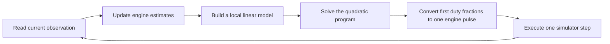

# Quadratic programming for the lunar lander

This standalone project implements **QP-based Model Predictive Control** in
[`qp.py`](../src/lunar_qp/qp.py). It plans with a small physics model, solves a
convex quadratic program with OSQP, applies one discrete engine command, observes
the result, and repeats. No policy training or checkpoint is required.

## 1. What is a quadratic program?

Imagine choosing how much to use each engine over the next few seconds. You
want to approach the landing pad, slow down and remain upright. You also want
to respect the available engine power. A quadratic program expresses these
preferences as **squared errors** and these restrictions as **linear constraints**.

The solver chooses numbers that minimize the total penalty while satisfying
the constraints. Squaring an error makes large errors especially expensive:
twice the speed error produces four times its contribution to the cost.

OSQP accepts the standard form:

```text
minimize     1/2 zᵀ P z + qᵀ z
subject to   lower ≤ A z ≤ upper
```

`z` contains the decisions. `P` and `q` specify the cost. `A`, `lower` and
`upper` specify the restrictions. Our `P` is positive definite, so this is a
convex optimization problem. A solved status describes the mathematical QP
to numerical tolerances, not the accuracy of its physics or a safe real landing.

See the official [OSQP formulation](https://osqp.org/docs/solver/index.html)
and [Python interface](https://osqp.org/docs/interfaces/python.html).

## 2. QP and MPC are different parts of the same process

**MPC** is the repeated planning loop. **QP** is the optimization used inside
that loop. This implementation replaces discrete beam search with a convex QP;
it still observes, predicts, chooses one action and replans.



The default plan has 16 blocks of four physics steps each: `16 × 4 / 50 = 1.28`
seconds. The simulator receives only one command for 0.02 seconds before the
controller observes again. Four-step blocks describe prediction resolution;
they do not mean the controller ignores observations for four steps.

The [OSQP MPC example](https://osqp.org/docs/examples/mpc.html) demonstrates the
same repeated constrained-optimization pattern with linear dynamics.

## 3. What information is available?

The controller receives the same eight vector observations as the discrete RL
and beam-search controllers: horizontal position, height, horizontal/vertical
velocity, tilt, angular velocity and two leg-contact indicators.

`state_from_obs` converts the first six entries to physical simulation units
using `[10, 20/3, 5, 7.5, 1, 2.5]`. The known central pad, gravity and nominal
engine effects are prior assumptions. Height zero is the nominal resting body
center, not measured clearance to arbitrary terrain.

The controller never receives future observations, terrain polygons, rewards,
simulator bodies or the scheduled engine fault. It retains its estimated
physics, previous numerical solution and actuator-allocation balance. This is
compact memory from previous measurements, not offline policy training. The
evaluator records full histories solely for scoring and replay.

## 4. From nonlinear physics to linear predictions

The underlying approximate model includes sine/cosine coupling between tilt
and thrust. A plain convex QP cannot directly impose those nonlinear equations.
At each observation, `linearize` builds a local affine approximation:

```text
x[k+1] = Ad x[k] + Bd u[k] + c
```

`x` is `[horizontal position, height, vx, vy, tilt, angular velocity]`.
`u` is `[main duty, left duty, right duty]`.

Linearization is about the measured tilt and the estimated hover duty,
clipped to [0, 1]. The attitude derivative therefore assumes nominal hover
thrust. Matrices are held fixed within one solve and rebuilt at the next real
observation. Position is integrated after velocity, using the same semi-implicit
Euler convention as the small physical model.

This is a **local model**, not a linearization of the full articulated Box2D
simulator. Large tilt changes, engine dispersion, leg dynamics and the change
from fractional thrust to actual pulses create prediction errors. Replanning
helps respond to errors; it does not make them disappear.

## 5. The decision variables and objective

Predicted states are eliminated algebraically before solving:

```text
X = base + response U
```

`base` is the state sequence with zero future engine duties under the affine
model. `response` maps future duties `U` into changes in that sequence. The code
constructs both by applying the affine recurrence. This is called **condensing**;
it preserves the QP's linear dynamics while reducing optimization variables.

With 16 blocks, the decision vector has 96 entries:

- 48 engine duties: three per block.
- 48 nonnegative slack variables: clearance, tilt and viewport slack per block.

The cost before substitution is:

```text
sum_k (x[k] - reference[k])ᵀ Q[k] (x[k] - reference[k])
      + 0.03 * sum_k ||u[k]||²
      + sum_k (1000*clearance_slack[k]²
               + 200*tilt_slack[k]² + 1000*viewport_slack[k]²)
```

State weights are `[0.3, 0.2, 0.5, 5, 25, 2]`; the final state receives five
times those weights. Desired horizontal position, horizontal velocity, tilt
and angular velocity are zero. A height reference progresses toward touchdown
at a limited descent rate, with a slower vertical-speed target near the ground.
It is computed once from the current observation and held fixed during the solve.

After substitution, the control Hessian is
`2*(responseᵀ Q response + 0.03 I)`. The linear term is
`2*responseᵀ Q (base-reference)`. The constant cost term is omitted because it
does not change the minimizer. Consequently the recorded OSQP objective is not
an episode reward or an absolute measure comparable across different states.

## 6. Hard engine bounds and soft approach limits

Every planned block satisfies:

```text
0 ≤ main, left, right ≤ 1
main + left + right ≤ 1
```

These constraints prevent the relaxed planner from demanding several full
engines at once. The remaining fraction is coast time.

Approach restrictions are softened with explicitly penalized slack:

```text
height ≥ 0.5 * (|horizontal offset| - 1.1) - clearance_slack
height ≥ -0.05 - clearance_slack
|tilt| ≤ 0.65 + tilt_slack
|horizontal offset| ≤ 8.5 + viewport_slack
```

Each absolute value is implemented as two linear inequalities. These limits
apply to future predicted states. Slack lets the QP describe an unfavorable
state without declaring the whole mathematical problem infeasible. A positive
slack means a requested approach margin was violated; it is not proof that the
actual terrain is safe. The margins are design choices, not measured uncertainty
bounds. Clearance, angle and position have different units, so inspect their
individual values when doing detailed research; the replay's maximum slack is
only a compact diagnostic.

## 7. The important discrete-action approximation

The original environment permits exactly one of four actions: coast, left
engine, main engine or right engine. QP uses continuous variables, so a result
such as `main=0.6, left=0.1, right=0.0` cannot be executed directly.

`allocate` translates it into fractions `[coast=.3, left=.1, main=.6, right=0]`.
It adds those fractions to a running balance, chooses the action with the
largest balance, then subtracts one from that action's balance. This is a simple
**pulse-density allocator**: it tries to realize fractional requests across
successive discrete commands. Tiny numerical bound violations are clipped and
the fractions normalized before allocation.

With a constant request, the counts track the desired proportions. During a
changing flight, the next actual state still differs from the fractional plan.
Only observations from the real discrete action update the dynamics estimate.
The amber replay path shows the relaxed prediction; the teal path shows what
the actual engine pulses produced.

This is **QP relaxation plus discrete allocation**, not an integer-optimal
controller. Enforcing one-hot binary engine choices inside the optimization
would require an MIQP or another discrete solver. Changing to continuous-action
LunarLander would instead change the actuator rules and would need a separately
labeled comparison.

## 8. Adaptation and solver failures

The online model uses bounded recursive least squares to update main/side
acceleration, translational biases, angular gain and angular bias. It compares
the observed velocity change with its prediction after every real action.
Contact impulses and extreme accelerations are excluded from fitting.

`--fixed-model` disables these updates but still solves a fresh QP after each
observation. A 30% engine-power loss at step 100 is introduced only by the
evaluator; both variants receive the same observation and action interfaces.

OSQP uses absolute and relative tolerances of `1e-4`, a maximum of 4,000
iterations, and a fixed internal ADMM penalty `rho=0.1`. Automatic penalty
adaptation was unreliable on some development problems. This numerical setting
is separate from adaptation of the lander's physical model. The previous
primal solution is supplied as a warm start; a fresh solver is built each step.
Reusing sparse matrix structures can be investigated if profiling justifies it.

Only solved/solved-inaccurate results with finite values and at most `0.005`
absolute violation of the assembled constraints are used. OSQP's inaccurate
status has looser numerical guarantees; it is counted separately. Other solver
statuses or invalid solutions trigger a recorded **coast fallback**, clearing
the warm start and allocation balance. This fallback guarantees a legal action,
not recovery or safety. On observed leg contact the controller also coasts and
lets Box2D settle. One-leg settling can fail the strict landing check.

See [OSQP status definitions](https://osqp.org/docs/interfaces/status_values.html).

## 9. Run it

From the repository root:

```bash
uv sync --locked
uv run lunar-qp --episodes 8 --seed 0 \
  --out dist/qp/nominal-adaptive.json --replay dist/qp/nominal-adaptive.html
uv run lunar-qp --episodes 8 --seed 0 --thrust-scale 0.7 \
  --out dist/qp/fault-adaptive.json --replay dist/qp/fault-adaptive.html
uv run lunar-qp --episodes 8 --seed 0 --fixed-model \
  --out dist/qp/nominal-fixed.json
uv run lunar-qp --episodes 8 --seed 0 --fixed-model --thrust-scale 0.7 \
  --out dist/qp/fault-fixed.json
```

Open a generated HTML replay directly; no server is needed. The command does
not open a browser. The replay shows actual action, duty fractions, relaxed
trajectory, model estimates, solver status/iterations, constraint violation,
maximum slack and fallback status. At the terminal frame, QP fields describe
the last recorded decision; there is no additional terminal optimization.

`uv run python -m lunar_qp.qp` is the equivalent module command.
`--horizon`, `--hold` and `--max-iter` configure prediction and computation.
`--change-step` changes the fault time. See `uv run lunar-qp --help` for options.

The evaluator temporarily changes a process-local Gymnasium engine constant
inside `env.step` and restores it afterward. Do not run other environments in
the same process concurrently with this injector. Separate CLI processes have
independent simulator state.

## 10. Evaluation and next research steps

Success requires termination without a crash or time limit, a sleeping lander
with both legs contacting the surface, and both rendered foot endpoints between
the helipad flags. Reward alone is not success. JSON traces include all decisions,
final states, fault configuration, controller source hash, landing checks,
latencies, fallback counts, solver status and slack diagnostics.

Seeds 0–7 are development data and were used while correcting the descent
reference and solver conditioning. Treat subsequent evaluation seeds as held
out only until their results inform a change. Results are recorded separately
in [QP evaluation](qp-evaluation.md).

The earlier beam-search MPC uses different costs. Both controllers default to
a 1.28-second horizon, but their prediction and action-allocation methods differ. Direct differences in landing counts
therefore do not isolate the optimization algorithm. A fair solver comparison
needs matched dynamics, references, horizon, actuator rules and compute budget.

Next investigations:

1. Measure the difference between relaxed predictions and executed pulses.
2. Replace coast-on-failure with a validated recovery controller and a deadline.
3. Compare fixed versus adaptive models under noise, delay and thrust loss.
4. Compare pulse allocation with an MIQP using explicit binary engine choices.
5. Compare horizon and model-linearization choices under the same runtime budget.
6. Develop uncertainty bounds and recovery constraints before making safety claims.

The current simulation waits for every control decision. A 20 ms simulated
control interval does not establish a real-time guarantee or model delayed
commands. This is an inspectable research implementation.
